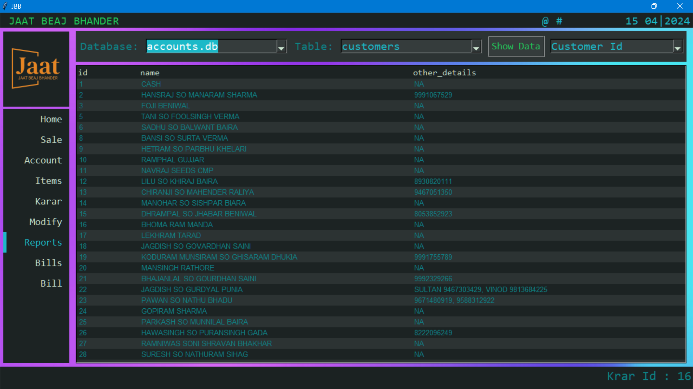

# High Table Holdings

High Table Holdings is a comprehensive Python software designed to simplify accounting, inventory management, and trading tasks, likely for an entity like "JAAT BEAJ BHANDER". Built with Python and Tkinter, it provides a user-friendly graphical interface (GUI) to manage accounts, track inventory, handle crop trading, generate reports, and more.

## Key Features

*   **Dashboard (`Home`):** Provides a visual overview of key business metrics using KPIs (Receivables, Payables, Net Position, Inventory Value, Krar Status, Notes) and graphs (Account Status, Financial Position, Receivables Overview, Krar Lists, Stock Lists). Includes a refresh button to update data.
*   **Account Management (`Account`):**
    *   Add new customer accounts with opening balances and details.
    *   Record customer transactions (debit/credit) with descriptions and tags influencing interest calculation.
    *   Calculates account balances, incorporating compound interest logic (considering financial year ends and settlement dates via `accounts.py`).
    *   Supports account settlement tracking (`Tag 0`).
*   **Inventory Management (`Items`):**
    *   Add new items with details like stock value, last value, unit, batch, expiry date, GST rate, type (Fertilizer, Pesticide, Seed, Other), and Pakka/Kacha status.
    *   Track item stock levels through received/sale transactions.
    *   View transaction history for each item.
    *   Dashboard highlights low-stock items.
*   **Sales Recording (`Sale`):**
    *   Record sales transactions, linking customers and inventory items. Uses searchable dropdowns.
    *   Handles both sales (`P` - debit customer, reduce stock) and returns/receipts (`M` - credit customer, increase stock).
    *   Updates inventory's last sale price automatically.
    *   Allows tagging transactions for interest calculation or settlement.
*   **Karar Management (`Karar`):**
    *   Track specific commitments or agreements ("Karar") linked to customers and dates.
    *   Automatically groups existing unsettled Karars or creates new ones.
    *   Mark Karars as settled.
    *   Dashboard displays Karars due today, overdue (past), and upcoming (future).
*   **Crop Trading (`Crop Trade`):**
    *   Manage Farmers (add, view) and Crop types (add, view with units).
    *   Record Crop Purchases from farmers (calculating actual quantity based on net and k-quantity).
    *   Record Crop Sales (optionally add buyer details).
    *   Automatically tracks Crop Stock levels and weighted average costs.
    *   View Purchase History, Sales History, and Stock Summary reports directly within the module.
*   **Data Reporting (`Reports`):**
    *   View data from various underlying database tables (Accounts, Inventory, Daily Notes, Karar, Crop Trading).
    *   Provides a sortable overview of customer accounts with a calculated score (based on amount and days outstanding).
    *   Allows drilling down into individual customer/item transaction tables from the main overview.
    *   Export displayed table data to Excel (`.xlsx`) files.
*   **Data Modification (`Modify`):**
    *   Interface to directly view, modify, or delete specific rows in selected database tables. **Use with caution!**
*   **Daily Notes:**
    *   Logs significant actions (adding accounts/items, sales, receives, modifications, deletions) automatically categorized by date in `daily_notes.db`.
*   **Theme Customization:** Toggle between a light and a dark theme using the 🎨 icon in the title bar.
*   **User Interface:**
    *   Navigation menu with sections for different modules.
    *   Keyboard shortcuts (Alt+H, Alt+S, Alt+A, Alt+I, Alt+K, Alt+M, Alt+R, Alt+C) for quick navigation.
    *   Custom search bar widgets for efficient selection of accounts/items.
    *   Status bar for feedback messages.

## Technology Stack

*   **Language:** Python 3.x
*   **GUI:** Tkinter, ttk
*   **Database:** SQLite3 (using `accounts.db`, `inventory.db`, `daily_notes.db`, `krar.db`, `crop_trading.db`)
*   **Data Handling:** Pandas (primarily in `mypandasfile.py` for dashboard aggregation)
*   **Plotting:** Matplotlib (for dashboard graphs)
*   **Excel Export:** openpyxl

## Screenshots

*(Screenshots provide a visual understanding of the application)*

*   **Dark Theme**
    *   HomePage
        
    *   Accounts
        
    *   Items
        
    *   Krar
        
    *   Modify
        
    *   Reports
        
        
    *   *(Add Crop Trading screenshot if available)*

*   **Light Theme**
    *   HomePage
        
    *   Accounts
        
    *   Items
        
    *   Krar
        
    *   Modify
        
    *   Reports
        
        
        
    *   *(Add Crop Trading screenshot if available)*

## Setup and Installation

1.  **Prerequisites:**
    *   Python 3.x installed on your system.
    *   `pip` (Python package installer).
    *   **Operating System:** Primarily developed and tested on Windows. Folder paths (`C:/JBB/`) are currently hardcoded for Windows.

2.  **Get the Code:**
    *   Clone the repository or download the project files to your local machine.

3.  **Install Dependencies:**
    *   It's highly recommended to use a Python virtual environment:
        ```bash
        python -m venv venv
        # On Windows:
        venv\Scripts\activate
        # On macOS/Linux:
        # source venv/bin/activate
        ```
    *   Install the required Python libraries:
        ```bash
        pip install pandas matplotlib openpyxl
        ```
        *(Note: Tkinter and SQLite3 are usually included with standard Python installations)*

4.  **Required Folder Structure:**
    *   The application requires a specific folder structure on your `C:` drive. It will attempt to create these automatically on first run:
        *   `C:/JBB/`
            *   `data/` (Stores all `.db` database files)
            *   `bills/` (Folder structure created, but billing logic might be excluded/incomplete)
            *   `pdfs/` (Folder structure created)
            *   `merged_pdfs/` (Folder structure created)
    *   Ensure you have permissions to create folders and files in `C:/`. If not, you may need to adjust the paths in the code (primarily in `database/*.py` files and `main.py`).

5.  **Database Initialization:**
    *   The necessary SQLite database files (`accounts.db`, `inventory.db`, `daily_notes.db`, `krar.db`, `crop_trading.db`) will be created automatically inside the `C:/JBB/data/` folder when the application starts if they don't already exist, along with their initial table structures.

## Usage

1.  **Run the Application:**
    *   Navigate to the project directory in your terminal.
    *   Make sure your virtual environment is activated (if you created one).
    *   Execute the main script:
        ```bash
        python main.py
        ```

2.  **Navigating the UI:**
    *   The main window will appear, typically maximized ("zoomed").
    *   Use the **left-hand menu** (Home, Sale, Account, Items, Karar, Modify, Reports, Crop Trade) to switch between modules.
    *   Alternatively, use **keyboard shortcuts** (e.g., `Alt+H` for Home, `Alt+S` for Sale).
    *   The **top bar** displays the company name ("JAAT BEAJ BHANDER"), date, and icons for refreshing the dashboard (📊/↻) and toggling the theme (🎨).
    *   The **bottom status bar** provides feedback on actions performed.

3.  **Using Sections:**
    *   **Home:** View the dashboard KPIs and graphs. Click the refresh icon (📊 or ↻) to load/update data (calls `mypandasfile.get_all_list` and database functions).
    *   **Sale:** Record sales or receive items back. Use the searchable dropdowns for Account and Item. Quantity and Price are required. Select the appropriate Tag for interest calculation/settlement.
    *   **Account:** Add new customer accounts and their initial opening balance/transaction.
    *   **Items:** Add new inventory items with their various details.
    *   **Karar:** Add new Karar entries for customers (select account, date) or settle existing ones (select account from unsettled list).
    *   **Crop Trade:** Manage farmers/crops, record purchases/sales specific to crops, and view associated reports.
    *   **Reports:** Select a database and table to view its contents. Special views for `customers` (aggregated data) and `items` (calculated stock/value) are available. Use the "Export" button to save the current view to Excel. Double-click `customers` or `items` rows to view their respective transaction tables. Ctrl+Click a transaction row to load it into the Modify page.
    *   **Modify:** Select a database, table, and row ID to view its data. Edit the data in the "Modify Row" field (using `|` as a separator) and click "Modify" to save changes, or click "Delete" to remove the row. **Use with caution!**

## File Structure

```
HighTableHoldings/
├── main.py             # Main application entry point, GUI layout
├── gui/
│   ├── __init__.py
│   ├── homepage.py       # Dashboard UI and logic (graphs, KPIs, lists)
│   ├── sales.py          # Sales/Receive page UI and logic
│   ├── accounts.py       # Add Account page UI and logic
│   ├── items.py          # Add Item page UI and logic
│   ├── karar.py          # Karar page UI and logic
│   ├── reports.py        # Reports page UI and logic
│   ├── modify.py         # Modify page UI and logic
│   ├── crop_trading.py   # Crop Trading page UI and logic
│   ├── mytheme.py        # Color theme definitions (Colors, Colors1)
│   └── searchbar.py      # Custom searchable dropdown widget
├── database/
│   ├── __init__.py
│   ├── accounts.py       # Logic and functions for accounts.db
│   ├── inventory.py      # Logic and functions for inventory.db
│   ├── database.py       # Logic and functions for daily_notes.db
│   ├── krar.py           # Logic and functions for krar.db
│   └── crop_database.py  # Logic and functions for crop_trading.db
├── mypandasfile.py     # Data processing using pandas (get_all_list, get_one_total)
├── myicons/            # Folder for icons and images (e.g., logos.png)
├── tool.py             # Utility script to combine code (not part of the app runtime)
└── README.md           # This file
# Potentially other files/folders like 'bills/' if they exist
```

## Database Overview

The application utilizes several SQLite databases stored in `C:/JBB/data/`:

*   **`accounts.db`:** Stores customer information (`customers` table) and individual transaction histories (`customer_<id>` tables). Includes logic for compound interest calculation considering settlements and tags.
*   **`inventory.db`:** Stores item master data (`items` table) and individual item transaction histories (`item_<id>` tables). Tracks stock value, last value, batch, expiry, etc.
*   **`daily_notes.db`:** Stores simple text notes organized into tables named by date (e.g., `d2023_10_27`), primarily used for logging application events.
*   **`krar.db`:** Manages Karar commitments (`all_krar` table storing customer link and status) and their associated dates (`by_krar_id` table).
*   **`crop_trading.db`:** Manages data related to agricultural commodity trading, including `farmers`, `crops`, `purchases`, `sales`, and `stock` tables.

*(Note: This README is based on the provided code snippets. Functionality related to files not included might exist but isn't fully described here.)*

## Additional Information

*   **Documentation:** You can find more details [here](documentation.md) *(Create this file if needed)*
*   **License:** This software is available under the MIT License. *(Assuming MIT - update if different)*
*   **Contributions:** Contributions to improve the software are welcome. Please refer to the contributing guidelines for details. *(Create CONTRIBUTING.md if needed)*
*   **Contact:** For any questions or feedback, please contact Parmod Sihag on [LinkedIn](https://www.linkedin.com/in/parmodsihag/).

**We hope High Table Holdings helps you streamline your business management processes!**