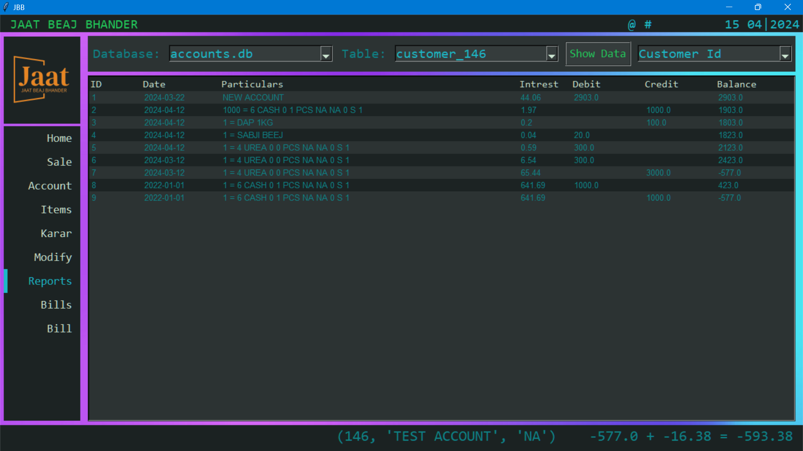

# High Table Holdings: A Python Accounting and Inventory Management System
High Table Holdings is a comprehensive Python software designed to simplify accounting and inventory management tasks for businesses and individuals. It provides a user-friendly interface and a range of features to manage accounts, track inventory, generate reports, and more.
## Key Features:
* **Account Management:**
    * Create and manage customer accounts with details and opening balances.
    * Record transactions (debit/credit) with descriptions and tags.
    * Track account balances and generate reports with interest calculations.
    * Manage "Krar" (credit) system with due dates and settlements.
* **Inventory Management:**
    * Add and manage items with stock values, units, batch details, expiry dates, and GST rates.
    * Record item transactions (received/sale) with quantities and descriptions.
    * Track current stock levels and values.
* **Reporting:**
    * Generate reports for accounts, inventory, and daily activities.
    * View summaries of transactions, balances, and stock levels.
    * Visualize data with graphs and charts.
* **Data Modification:**
    * Modify or delete existing records in accounts and inventory.
    * Update transaction details, customer information, and item data.
* **Bill Management:**
    * Generate bills with customer details, itemized lists, and totals.
    * Convert bills from docx format to PDF for easy sharing and printing.
    * Merge multiple PDF bills into a single document.

## Getting Started:
### System Requirements:
* **Operating System:** Windows (developed and tested on Windows)
* **Python Version:** Python 3.7 or later
* **Required Libraries:** tkinter, pandas, matplotlib, docx2pdf, PyPDF2
* **Installation:** Use pip to install the required libraries:
  ```
  pip install tkinter pandas matplotlib docx2pdf PyPDF2
### Launching the Software:
1. **Download:** Download the High Table Holdings source code.
2. **Extract:** Extract the downloaded files to a desired location on your computer.
3. **Run:** Open a terminal or command prompt in the extracted folder.
4. **Execute:** Run the following command:
   ```
   python main.py
### Initial Setup:
* Upon first launch, the software will automatically create the necessary SQLite databases in the **C:/JBB/data** folder.
* You can start adding accounts, items, and transactions right away.
### Navigation:
* The main menu provides access to different modules: Home, Sales, Account, Items, Karar, Modify, Reports, Bills, and Bill Show.
* Click on the desired menu item to switch between modules.
* Alternatively, use keyboard shortcuts: Alt + H (Home), Alt + S (Sales), Alt + A (Account), etc.
### Basic Tutorials:
1. Creating a Customer Account:
   1. Go to the Account module.
   2. Enter the customer's name in the Name field.
   3. Provide any additional details in the Other Details field (optional).
   4. Enter the opening balance in the Opening Balance field (if applicable).
   5. Click the Add Account button.
2. Adding an Inventory Item:
   1. Go to the Items module.
   2. Enter the item name in the Item Name field.
   3. Specify the source of the item in the Source field.
   4. Enter the current stock value in the Stock Value field.
   5. Fill in other details like Last Value, Unit, Batch, Expiry, GST Value, Type, and Pakka Kacha as needed.
   6. Click the Add Item button.
4. Recording a Sales Transaction:
   1. Go to the Sales module.
   2. Select the date of the transaction. (Defaults to today's date)
   3. Choose the customer's account from the Account dropdown menu.
   4. Select the item sold from the Item dropdown menu.
   5. Enter the quantity sold in the Quantity field.
   6. Verify or adjust the price in the Price field.
   7. Choose the appropriate tag from the Tag dropdown menu.
   8. Click the Sale button.
5. Generating a Report:
   1. Go to the Reports module.
   2. Select the desired database (accounts.db or inventory.db) from the Database dropdown menu.
   3. Choose the specific table to view from the Table dropdown menu.
   4. Click the Show Data button to display the report.


These basic tutorials provide a starting point for using High Table Holdings. Explore the software further to discover its full potential and customize it to your specific needs.
   
## Screenshots:
* Dark Theme
   * HomePage
     
     

   * Accounts
     
     

   * Items
     
     

   * Krar

     

   * Modify

     

   * Reports
     
     
     
     
       
* Light Theme
   * HomePage
     
     

   * Accounts
     
     

   * Items
     
     
    
    * Krar

     

   * Modify

     
   * Reports
     
     
     
     
     
     
     
## Additional Information:
* **Documentation** You can find documentation [here](documentation.md)
* **License:** This software is available under the MIT License.
* **Contributions:** Contributions to improve the software are welcome. Please refer to the contributing guidelines for details.
* **Contact:** For any questions or feedback, please contact [Linkedin](https://www.linkedin.com/in/parmodsihag/).


**We hope High Table Holdings helps you streamline your accounting and inventory management processes!**
