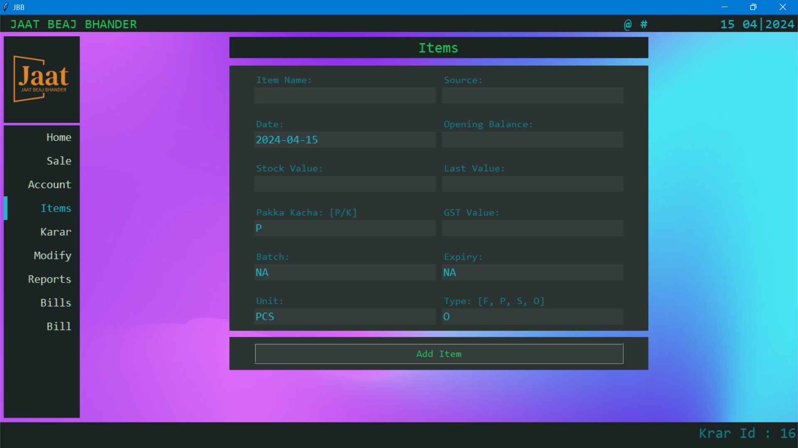
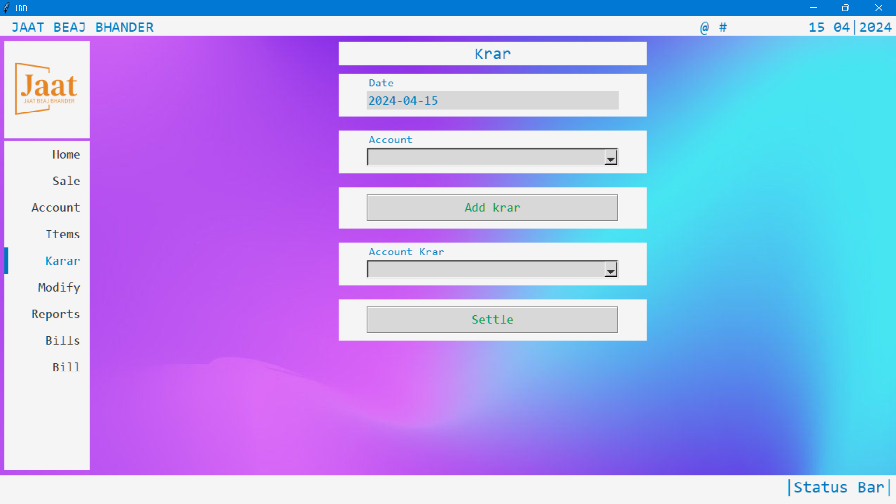
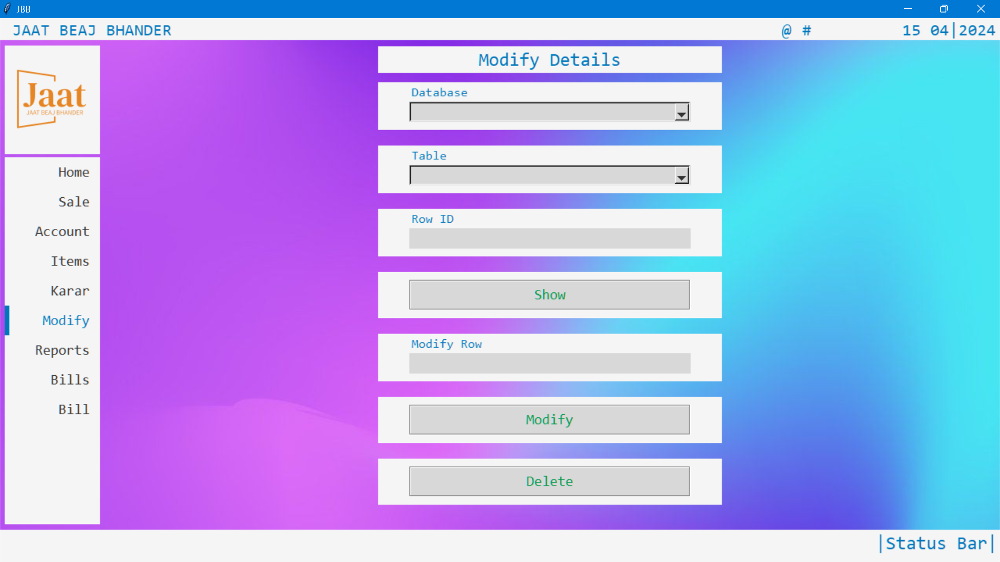

# High Table Holdings Documentation
This documentation provides a detailed guide on using the High Table Holdings software for accounting and inventory management.
## 1. Modules:
### Home:

* Provides an overview of the system with graphical representations of key data.
* Displays summaries of accounts, inventory, and recent activities.
* Allows you to visualize trends and patterns using graphs and charts.
### Sales:

* Record sales transactions with customer details, items sold, quantities, prices, and tags.
* Update inventory levels automatically based on sales.
* Generate daily notes for sales activities.
### Account:

* Create and manage customer accounts with names and additional details.
* Set opening balances for new accounts.
* Record transactions (debit/credit) with descriptions, amounts, and tags.
* Track account balances and view transaction history.
### Items:

* Add and manage inventory items with names, stock values, units, batch details, expiry dates, GST rates, types, and "Pakka/Kacha" status.
* Record item transactions (received/sale) with quantities, descriptions, and sources.
* Track current stock levels and values.
### Karar:

* Manage the "Krar" (credit) system for customer accounts.
* Record "Krar" due dates for specific customers.
* Mark "Krar" as settled once payments are received.
* View a list of customers with unsettled "Krar" and their due dates.
### Modify:

* Modify or delete existing records in accounts and inventory.
* Update transaction details, customer information, and item data.
* Requires careful attention to avoid accidental data loss.
### Reports:

* Generate detailed reports for accounts and inventory.
* View transaction history, balances, stock levels, and other relevant information.
* Filter and sort data based on various criteria.
* Export reports for further analysis or record-keeping.

## 2. Data Entry and Management:
* Use the provided entry fields and dropdown menus to input data accurately.
* Double-check information before submitting to avoid errors.
* Utilize the modify module to correct any mistakes or update existing records.
* Regularly back up your databases to prevent data loss.
  
## 3. Reports and Analysis:
* Generate reports to gain insights into your financial and inventory status.
* Analyze trends and patterns to make informed business decisions.
* Use the visualization tools to understand data more effectively.

## 4. Tips:
* Utilize keyboard shortcuts for faster navigation and data entry.
* Explore the different features and functionalities of each module.
* Customize the software's appearance by switching between light and dark themes.
* Keep the software updated to benefit from the latest improvements and bug fixes.
  
**We believe this documentation will assist you in effectively using High Table Holdings for your accounting and inventory  management needs.**